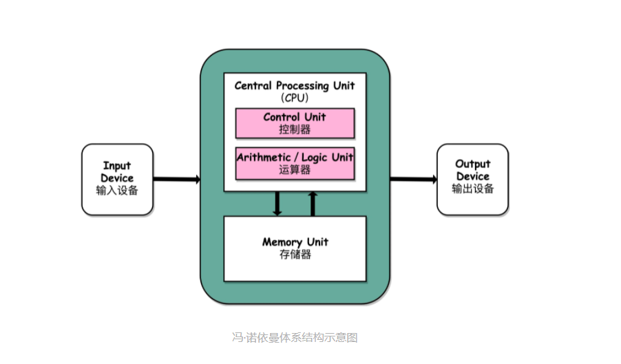
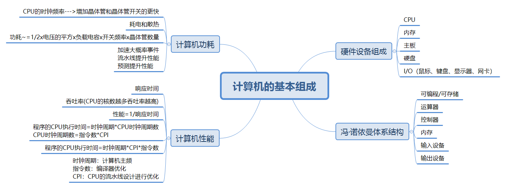

# 入门篇

## 01 | 冯·诺依曼体系结构：计算机组成的金字塔

### 1、计算机的基本硬件组成

**CPU(Central Processing Unit)：**中央处理器，负责计算。

**内存：**软件加载到内存中才能运行，程序读取的数据，计算的结果都放在内存中。

**主板：**有许多插槽，芯片组和总线解决CPU和内存的通信问题。

- **芯片组：**数据传输的流转。
- **总线：**实际数据传输的通道，总线速度即数据传输多快。

**电源：**供电。

**I/O设备：**输入输出设备（显示器、鼠标、键盘）。

**硬盘：**将各种数据持久存储下来。

**显卡：**显卡中除了CPU还有**GPU(Graphics Processing Unit，图形处理器)**。

鼠标、键盘、硬盘通过主板上的**南桥**芯片组与**CPU**之间进行通信；内存、显卡通过主板上的**北桥**芯片组与CPU之间进行通信，随时间推移北桥芯片组已经移到CPU内部去了。

### 2、冯·诺依曼体系结构

手机组成：SD卡（硬盘），SoC（CPU、内存、网络通信、摄像头封装到一个芯片）。

冯·诺依曼体系结构：存储程序计算机满足**可编程**和**存储**。

- 可编程：程序不会在计算机硬件层面上“写死”。
- 存储：程序存储在计算机内存中，通过加载不同的程序来解决不同的问题。

First Draft认为计算机应该是这样组成的：CPU、内存、I/O。

**CPU：**运算器和控制器。

- 运算器(ALU)：算术逻辑单元和处理器寄存器，用来完成各种算术和逻辑运算。
- 控制器：程序计数器和指令寄存器，控制程序的流转，在不同条件下的分支和跳转。

**内存：**存储数据和指令。

**I/O：**输入输出设备（鼠标、键盘、显示器、网卡......）。

## 02 | 给你一张知识地图，计算机组成原理应该这样学

 **总结：1、计算机的基本组成**是由运算器、控制器、存储器、输入设备、输出设备五大基本组件，性能和功耗是计算机的两个核心指标。**2、接下来是指令和计算**我们的编程语言通过编译器和汇编器（汇编语言）变成机器指令；操作系统通过将机器码指令进行链接、装载、执行（操作系统）这部分是由**控制器**来控制这一条条指令；我们需要知道整数、浮点数通过二进制的怎么表示，加法器和乘法器是怎么制作然后通过**运算器**来进行运算。**3、CPU的设计**CPU时钟可以用来构成寄存器和内存的锁存器和触发器，数据通路连接运算器和控制器，出于对性能和功耗的考虑，面向流水线设计的CPU、数据和控制冒险以及分支预测技术，CPU作为控制器需要和I/O进行通信所以有了异常和中断机制。**4、存储器原理：**储存器的层次结构（从上到下：CPU高速缓存--->内存--->SSD硬盘--->机械硬盘）作为基本框架了解他们之间的原理和差别，存储器通常也作为输入输出设备需要了解CPU和存储器之间怎么通信，考虑性能问题我们应该需要了解IO_WAIT，以及通过DMA技术来提升性能，对于存储器还要保证数据不能丢失我们需要掌握RAID、Erasure Code、ECC 以及分布式 HDFS，这些不同的技术，来确保数据的完整性和访问性能。

> **学会提问来串联知识点：**1、我写的程序，是怎样从输入的代码，变成运行的程序，并得到最终结果的？2、整个过程中，计算器层面到底经历了哪些步骤，有哪些地方是可以优化的？

## 03 | 通过你的CPU主频，我们来谈谈“性能”究竟是什么？

### 1、什么是性能？时间的倒数

我们用**响应时间和吞吐率**来衡量性能，**响应时间**指我们执行一个程序到底要花多少时间，花的时间越少说明性能越好；**吞吐率**指我们在一定时间范围内到底能执行多少“事情”（处理的数据和执行程序的指令）。为了提升程序的性能，我们一般都会提升程序的吞吐率类似现代我们的服务器都是8核、16核(人多力量大，同时处理数据，在单位时间内就可以处理更多数据，吞吐率自然也就上去了)。但是响应时间的提升却没有那么容易因为CPU的性能在10年前就处于挤牙膏状态，所以我们一般把性能，定义成响应时间的倒数：**性能=1/响应时间**。

### 2、计算机的计时单位：CPU时钟

虽然时间是衡量性能的指标，但是时间不“准”，因为在计算机中可能会有多个程序在运行，在程序之间的切换会浪费掉时间，所以要想准确统计某个程序运行时间，进而去比较两个程序的实际性能，我们得把这些时间给刨掉。我们拿到的CPU时间也不能直接比较两个程序，计算机上的CPU可能会满载运行也可能降频运行。除了CPU时间，时间这个性能指标还会受到主板和内存其他硬件的影响。因此我们把时间进行拆解：**程序的 CPU 执行时间 =CPU 时钟周期数×时钟周期时间。**对于时钟周期时间我们软件工程师是无法改变的，所以提升性能我们只能减少CPU时钟周期数，**CPU时钟周期数=指令数x每条指令的平均时钟周期数(CPI)**。所以最终**程序的 CPU 执行时间 =指令数xCPIxClock Cycle Time。**

总结：我们要提升程序的性能所以就要优化上述3个因素：**指令数、时钟周期时间、每条指令的平均时钟周期时间CPI。**

- **时钟周期时间：**取决于计算机的主频。
- **指令数：**取决于编译器的优化。
- **CPI：**即一条指令需要多少个CPU Cycle，现代CPU的流水线技术让每条指令执行的CPU Cycle竟可能少。

## 04 | 穿越功耗墙，我们该从哪些方面提升“性能”？

**程序的 CPU 执行时间 =指令数xCPIxClock Cycle Time**，如果想要提升计算机的性能，对于指令数和CPI的提升是不容易的，所以我们把重点放在了CPU的时钟频率。在CPU上面放更多的晶体管，不断提高CPU的时钟频率，程序执行时间缩短。

### 1、功耗：CPU的“人体极限”

功耗问题是限制CPU主频提升的因素，我们的CPU是**超大规模的集成电路**，由一个个晶体管组成的，通过晶体管里面的开关不断“打开”和“关闭”来完成各种运算和功能。想要计算得快我们要在相同的面积下放更多的晶体管增加密度，另一方面我们让晶体管“打开”和”关闭“得更快一点来提高CPU的主频，这两者都会**增加功耗**，进而带来**耗电和散热问题**，达到极限就会导致CPU崩溃。如果增加CPU的面积，晶体管的距离增大，电信号传输的时间就会更长，运算速度自然就慢了。功耗~=1/2x负载电容x电压的平方x开关频率x晶体管数量。为了提升性能我们增加开关的主频和晶体管的数量，这时功耗就会增加，这时我们就要**降低电压**。

### 2、并行优化，理解阿姆达尔定律

虽然制程的优化和电压的下降，让CPU的性能有所提升但是近年来CPU的主频已经达到了一个高度所以提升性能通过提升CPU的主频可能不太合适了，所以我们通过提高吞吐率（我们现在用的2核、4核、8核的CPU）通过并行的方式来提升性能。这就是我们在进行性能优化所用的阿姆达尔定律，对于一个程序进行优化后，处理器并行运算的效率提升情况是：优化后的执行时间=受优化影响的执行时间/加速倍数+不受影响的执行时间。

### 3、总结延伸

无论是简单的通过提升主频，还是增加更多的CPU的数量，都会遇到对应的瓶颈。除了“摩尔定律”和“并行计算”之外，还有这样几个原则性的性能提升方法：

- **加速大概率事件：**
- **通过流水线提升性能：**我们把CPU指令执行的过程进行拆分，细化运行。
- **通过预测提升性能：**通过预先猜测下一步该干什么，而不是等到上一步运行的结果，提前运行结果，让程序跑得更快一点。

## 05 | 总结

