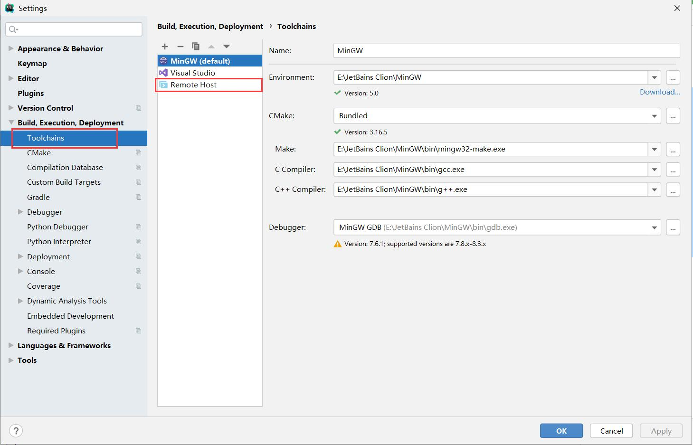
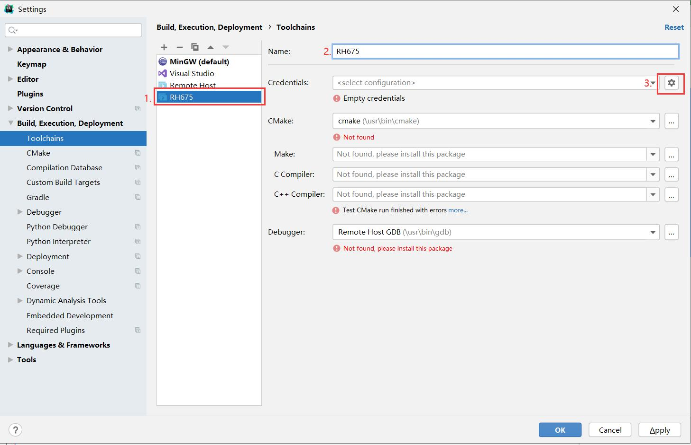
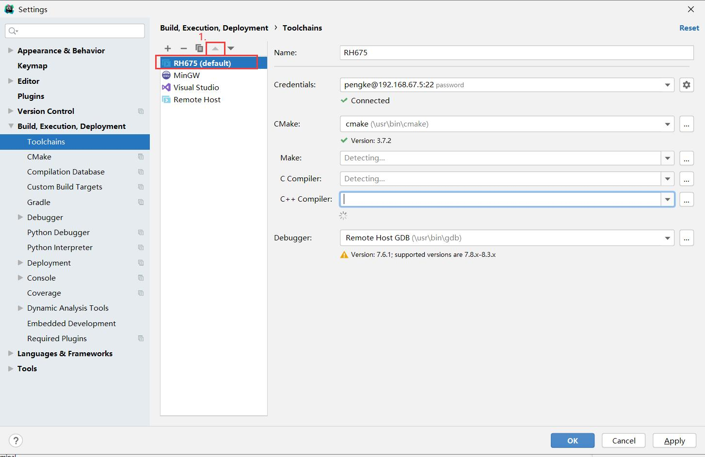
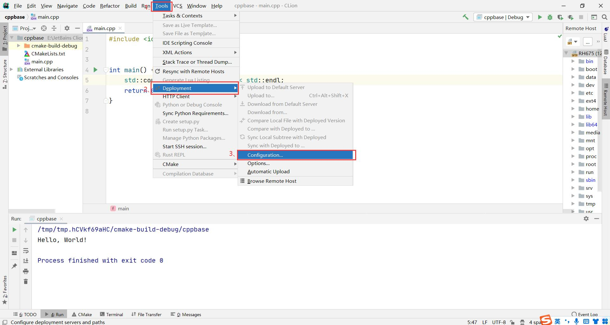
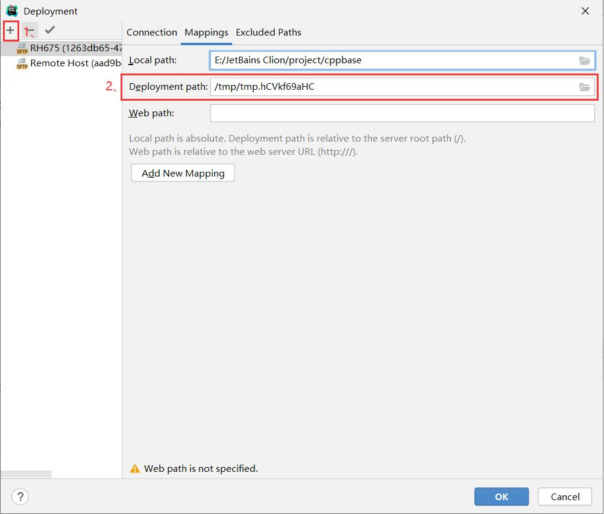
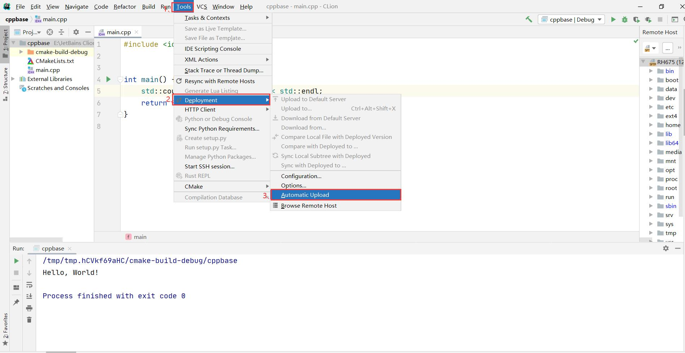
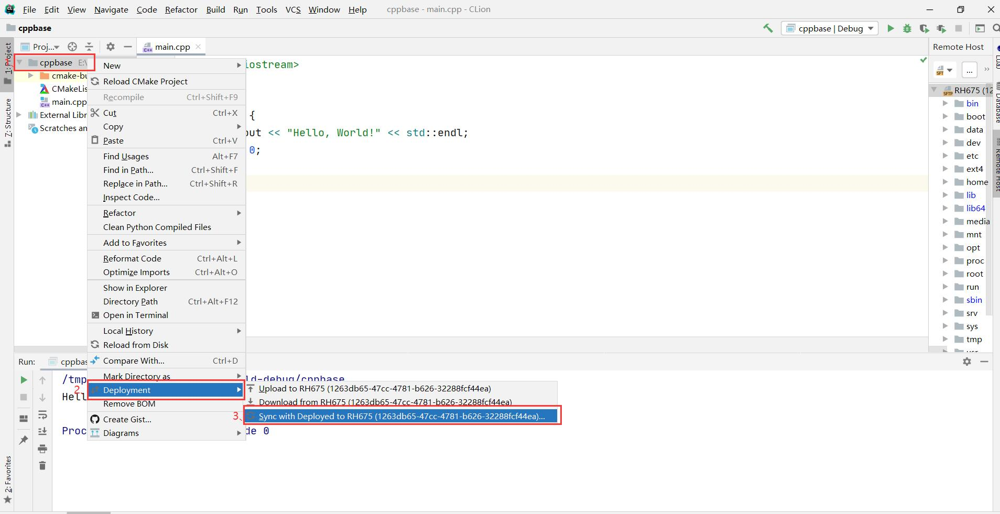
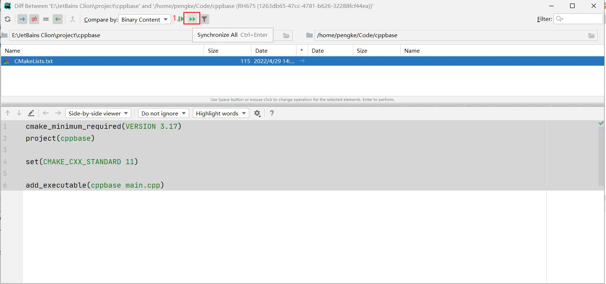

# CLion配置连接远程Linux进行Cpp开发

### 1、找到设置中的工具链，点击添加远程主机

### 2 、修改名字，然后点击设置远程的ip和登录用户名、密码

### 3、 点击向上箭头将配置好的远程主机顶到最上方设置为默认的编译器

### 4、找到Tools中的部署，然后找到部署中的配置

### 5、添加连接sftp工具，然后找到Mappings(设置远程的目录和本地的目录映射关系)

### 6、找到Tools中的部署，然后点击部署中的自动上传

### 7、点击项目中的部署，然后点击同步到远程(这样本地修改了远程也会修改)

### 8、 点击同步全部

