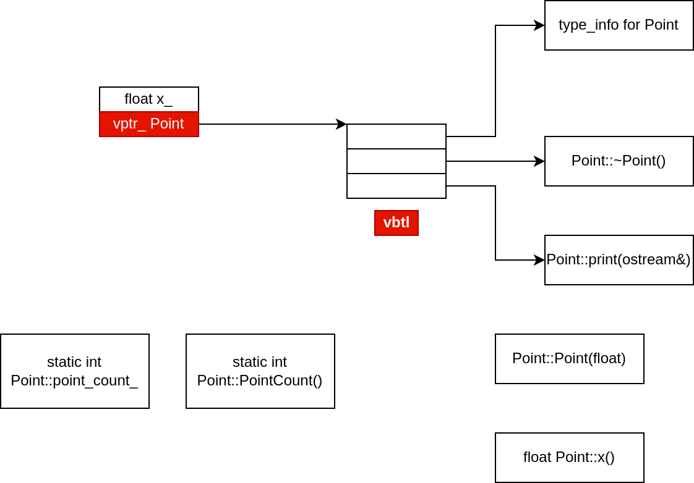

# 关于对象
## 1.1 C++对象模型
**data members:**
 - nonstatic data members 被配置在每一个class object 之内
 - static data members 则被存放在个别的class object之外

**function members:**
 - nonstatic function members 被配置在每一个class object 之外
 - static function members 也被放在个别的class objects之外
 - virtual functions 包含两步骤：1)、每一个class 产生一堆指向virtual functions的指针，放在表格之中，被称为vtbl; 2)、每个class object被安插一个指针，指向相关的virtual table, 被称为vptr

**列子如下:**
```cpp
class Point{
public:
    Point(float xval);
    virtual ~Point();

    float x() const;
    static int PointCount();
protected:
    virtual ostream& print(ostream& os) const;
    float x_;
    static int point_count_;
};
```

以下是类的布局方式:

